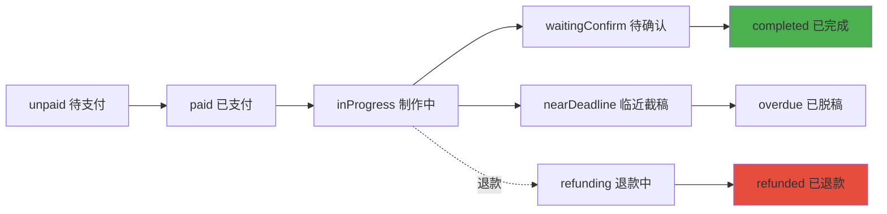

# 后端接入准备文档

> **更新时间**: 2025-11-11  
> **适用场景**: 从本地mock数据迁移到真实后端API

---

## 📋 目录

1. [当前数据存储结构](#1-当前数据存储结构)
2. [核心业务逻辑](#2-核心业务逻辑)
3. [数据字段规范](#3-数据字段规范)
4. [需要替换的API位置](#4-需要替换的api位置)
5. [迁移策略建议](#5-迁移策略建议)
6. [关键注意事项](#6-关键注意事项)

---

## 1. 当前数据存储结构

### 1.1 用户相关

| Storage Key | 数据类型 | 说明 | 示例 |
|------------|---------|------|------|
| `userId` | String | 用户ID（1001起） | `"1001"` |
| `openid` | String | 模拟微信OpenID | `"openid-1001-timestamp"` |
| `userInfo` | Object | 用户信息 | `{nickName, avatarUrl, ...}` |
| `userRoles` | Array | 用户角色列表 | `["customer", "artist"]` |
| `hasLoggedIn` | Boolean | 登录状态 | `true` |
| `users` | Array | 所有用户列表 | `[{userId, nickName, ...}]` |

**用户信息结构**：
```javascript
{
  userId: "1001",
  nickName: "用户昵称",
  avatarUrl: "头像URL或base64",
  openid: "openid-1001-timestamp",
  phone: "手机号（可选）",
  memberLevel: "普通会员",
  memberExpireTime: "2025-12-31 23:59:59"
}
```

---

### 1.2 订单相关

| Storage Key | 数据类型 | 说明 | 状态值 |
|------------|---------|------|-------|
| `pending_orders` | Array | 待处理订单 | `unpaid`, `paid`, `inProgress`, `waitingConfirm` |
| `completed_orders` | Array | 已完成订单 | `completed` |
| `mock_orders` | Array | 模拟订单（用于测试） | 所有状态 |

**订单字段结构**：
```javascript
{
  // 基础信息
  id: "202511081234567890",           // 订单号（唯一）
  orderNumber: "202511081234567890",  // 订单编号（备用）
  
  // 商品信息
  productId: "product_001",
  productName: "商品名称",
  productImage: "图片URL或base64",
  spec: "规格1/规格2",                 // 规格组合（显示用）
  specs: [{spec1, spec2, price, quantity}],  // 规格详情（多规格）
  quantity: 1,                         // 数量
  price: "88.00",                      // 单价（字符串）
  totalAmount: 88.00,                  // 总金额（数字）
  
  // 时间信息（⚠️ 格式：yyyy-MM-dd HH:mm:ss）
  createTime: "2025-11-08 10:28:30",   // 下单时间
  startDate: "2025-11-08 10:28:30",    // 开始时间（备用）
  createdAt: "2025-11-08 10:28:30",    // 创建时间（备用）
  deadline: "2025-11-15 10:28:00",     // 截稿时间
  completedAt: "2025-11-15 09:00:00",  // 完成时间（可选）
  deliveryDays: 7,                     // 出稿天数
  
  // 用户信息
  buyerId: "1001",                     // 买家ID
  buyerName: "买家昵称",
  buyerAvatar: "买家头像URL",
  buyerPhone: "13800138000",           // 买家手机（可选）
  buyerOpenId: "openid-1001-xxx",      // 买家OpenID（可选）
  
  // 画师信息
  artistId: "1002",                    // 画师用户ID
  artistName: "画师昵称",
  artistAvatar: "画师头像URL",
  artistNumber: "001",                 // 🎯 画师独立编号（重要！）
  
  // 客服信息
  serviceId: "1003",                   // 客服用户ID
  serviceName: "客服昵称",
  serviceAvatar: "客服头像URL",
  serviceQrcodeUrl: "客服二维码URL",
  serviceQrcodeNumber: "客服编号",
  serviceStatus: "assigned",           // assigned | pending
  needsService: false,
  
  // 订单状态（⚠️ 核心字段）
  status: "inProgress",                // 订单状态（见状态表）
  statusText: "进行中",                // 状态文本（显示用）
  refundStatus: null,                  // 退款状态（refunding | refunded）
  
  // 进度相关
  wasOverdue: false,                   // 是否曾经脱稿
  overdueDays: 0,                      // 脱稿天数
  
  // 群聊信息（自动生成）
  groupName: "【订单202511...】买家昵称-画师昵称",
  
  // 其他
  urgent: false,                       // 是否加急
  items: []                            // 多商品订单（购物车）
}
```

**订单状态值（status）**：
```javascript
// 终止态（不可再变更）
'completed'      // 已完成
'refunded'       // 已退款
'cancelled'      // 已取消

// 进行中状态
'unpaid'         // 待支付
'paid'           // 已支付
'inProgress'     // 制作中
'processing'     // 处理中（备用）
'waitingConfirm' // 待确认
'nearDeadline'   // 临近截稿
'overdue'        // 已脱稿

// 退款中
'refunding'      // 退款处理中
```

---

### 1.3 商品相关

| Storage Key | 数据类型 | 说明 |
|------------|---------|------|
| `mock_products` | Array | 商品列表 |
| `product_counter` | Number | 商品ID计数器 |

**商品字段结构**：
```javascript
{
  id: "product_001",                   // 商品ID（唯一）
  name: "商品名称",
  description: "商品描述",
  images: ["图片1_base64", "图片2_base64"],  // 图片数组（base64或URL）
  descriptionImages: ["描述图1", "描述图2"],
  
  // 价格（单规格）
  price: 88,                           // 单价
  originalPrice: 128,                  // 原价（可选）
  
  // 价格（多规格）
  hasPricing: true,                    // 是否有多规格定价
  pricingMethod: "combined",           // combined | separate
  spec1Name: "尺寸",                   // 一级规格名
  spec1Values: ["半身", "全身"],       // 一级规格值
  spec2Name: "风格",                   // 二级规格名（可选）
  spec2Values: ["Q版", "写实"],        // 二级规格值（可选）
  pricing: [                           // 价格矩阵
    {spec1: "半身", spec2: "Q版", price: 88},
    {spec1: "半身", spec2: "写实", price: 128}
  ],
  
  // 库存
  stock: 99,                           // 库存数量
  sales: 0,                            // 销量
  
  // 分类
  categoryId: "category_001",
  categoryName: "分类名称",
  
  // 画师信息
  artistId: "1002",                    // 画师用户ID
  artistName: "画师昵称",
  artistAvatar: "画师头像URL",
  artistNumber: "001",                 // 🎯 画师独立编号
  
  // 其他
  deliveryDays: 7,                     // 出稿天数
  status: "active",                    // active | inactive
  createdAt: "2025-11-08 10:00:00",
  views: 0                             // 浏览量（已废弃）
}
```

---

### 1.4 画师申请相关

| Storage Key | 数据类型 | 说明 |
|------------|---------|------|
| `artist_applications` | Array | 画师申请列表 |
| `artist_number_counter` | Number | 画师编号计数器（001起） |

**申请字段结构**：
```javascript
{
  id: "app_timestamp",
  userId: "1001",                      // 申请人用户ID
  openid: "openid-1001-xxx",
  
  // 微信信息
  nickName: "微信昵称",
  avatarUrl: "微信头像",
  
  // 申请信息
  name: "真实姓名",
  age: "25",
  wechat: "微信号",
  idealPrice: "100",                   // 理想稿酬
  minPrice: "50",                      // 最低价格
  finishedWorks: ["作品图1", "作品图2"],  // 完成作品（base64）
  processImages: ["过程图1", "过程图2"],  // 创作过程图（base64）
  
  // 状态
  status: "pending",                   // pending | approved | rejected
  submitTime: "2025-11-08 10:00:00",
  reviewTime: "2025-11-08 12:00:00",   // 审核时间（可选）
  reviewNote: "审核备注",               // 审核备注（可选）
  
  // 审核通过后分配
  artistNumber: "001"                  // 🎯 画师独立编号（重要！）
}
```

---

### 1.5 财务相关

| Storage Key | 数据类型 | 说明 |
|------------|---------|------|
| `service_income_ledger` | Array | 客服收入账本 |
| `staff_income_ledger` | Array | 管理员分成账本 |
| `reward_records` | Array | 打赏记录 |
| `withdraw_records` | Array | 提现记录 |

**收入记录结构**：
```javascript
// 客服/管理员分成
{
  id: "income_timestamp",
  userId: "1003",                      // 客服/管理员ID
  orderId: "202511081234567890",
  incomeType: "service",               // service | admin_share
  amount: "5.00",                      // 分成金额
  orderAmount: "88.00",                // 订单金额
  note: "订单分成",
  createTime: "2025-11-08 10:00:00",
  orderCompletedAt: "2025-11-08 10:00:00"
}

// 打赏记录
{
  id: "reward_timestamp",
  artistId: "1002",                    // 画师ID
  customerId: "1001",                  // 打赏人ID
  orderId: "202511081234567890",       // 关联订单（可选）
  productName: "商品名称",
  amount: "10.00",                     // 打赏金额
  message: "画得真好！",               // 留言（可选）
  time: "2025-11-08 10:00:00"
}

// 提现记录
{
  id: "withdraw_timestamp",
  userId: "1002",                      // 提现人ID
  amount: "100.00",                    // 提现金额
  bankName: "中国银行",
  bankCard: "6217********1234",
  realName: "真实姓名",
  status: "completed",                 // pending | processing | completed | rejected
  time: "2025-11-08 10:00:00",
  completedTime: "2025-11-08 12:00:00",
  note: "提现备注"
}
```

---

### 1.6 其他数据

| Storage Key | 数据类型 | 说明 |
|------------|---------|------|
| `categories` | Array | 分类列表 |
| `notices` | Array | 公告列表 |
| `banners` | Array | 轮播图列表 |
| `service_qrcodes` | Object | 客服二维码（`{userId: {imageUrl, updateTime}}`） |
| `buyer_shows` | Array | 买家秀列表 |

---

## 2. 核心业务逻辑

### 2.1 用户ID双轨制（⚠️ 重要！）

**概念**：
- **用户ID（userId）**: 全局唯一，1001起，自增
- **画师编号（artistNumber）**: 画师专属，001起，自增，仅审核通过后分配

**分配逻辑**：
```javascript
// 用户注册时
userId = generateUserId()  // 1001, 1002, 1003...

// 画师申请通过时
artistNumber = generateArtistNumber()  // 001, 002, 003...
```

**显示优先级**：
- 画师相关：优先显示 `artistNumber`，降级显示 `userId`
- 用户相关：始终显示 `userId`

**后端设计建议**：
```sql
-- users表
CREATE TABLE users (
  user_id VARCHAR(20) PRIMARY KEY,     -- 1001, 1002...
  nickname VARCHAR(50),
  avatar_url TEXT,
  ...
);

-- artists表（画师额外信息）
CREATE TABLE artists (
  artist_id INT PRIMARY KEY AUTO_INCREMENT,
  user_id VARCHAR(20) REFERENCES users(user_id),
  artist_number VARCHAR(10) UNIQUE,    -- 001, 002...（重要！）
  status ENUM('pending', 'approved', 'rejected'),
  ...
);
```

---

### 2.2 订单状态流转



**终止态**（不可再变更）：
- `completed` - 已完成
- `refunded` - 已退款
- `cancelled` - 已取消

**状态计算逻辑**（自动）：
```javascript
// 在 utils/order-status.js 中实现
function calculateOrderStatus(order) {
  // 1. 终止态保护
  if (['completed', 'refunded', 'cancelled'].includes(order.status)) {
    return order  // 不修改
  }
  
  // 2. 时间判断
  const now = Date.now()
  const deadline = parseDate(order.deadline).getTime()
  const diffDays = Math.ceil((deadline - now) / 86400000)
  
  if (diffDays < 0) return 'overdue'      // 已脱稿
  if (diffDays <= 2) return 'nearDeadline'  // 临近截稿
  return order.status  // 保持原状态
}
```

---

### 2.3 订单分成计算

**分成规则**（按数量计算）：
```javascript
// 订单完成时触发分成
const orderAmount = order.totalAmount
const quantity = order.quantity

// 客服分成：¥5/件
const serviceFee = 5 * quantity

// 管理员分成：根据配置
const adminShareRate = getAdminShareRate()  // 默认5%
const adminFee = orderAmount * adminShareRate * quantity

// 画师收入
const artistIncome = orderAmount - serviceFee - adminFee
```

**后端设计建议**：
- 订单完成时触发分成计算
- 记录到独立的 `income_ledger` 表
- 支持分成规则配置

---

### 2.4 库存管理

**扣减时机**：
- 下单成功时 → 立即扣减库存
- 退款成功时 → 自动回退库存

**实现**：
```javascript
// 下单时
await decreaseStock(productId, quantity)

// 退款时
await increaseStock(productId, quantity)
```

**后端设计建议**：
- 使用数据库事务保证库存一致性
- 支持库存预警（低于阈值时提醒）

---

### 2.5 时间格式标准（⚠️ iOS兼容）

**存储格式**：
```javascript
"2025-11-08 10:28:30"  // yyyy-MM-dd HH:mm:ss
```

**解析方法**：
```javascript
// ❌ 错误（iOS不支持）
new Date("2025-11-08 10:28:30")

// ✅ 正确（iOS兼容）
parseDate("2025-11-08 10:28:30")  // 内部转换为 "2025/11/08 10:28:30"
```

**后端返回建议**：
- 数据库存储：`DATETIME` 类型
- API返回：ISO 8601 格式 `2025-11-08T10:28:30+08:00`
- 前端自行转换为展示格式

---

## 3. 数据字段规范

### 3.1 必填字段 vs 可选字段

**订单必填**：
```javascript
{
  id,           // 订单号
  productId,    // 商品ID
  productName,  // 商品名称
  price,        // 单价
  quantity,     // 数量
  totalAmount,  // 总金额
  createTime,   // 下单时间
  deadline,     // 截稿时间
  buyerId,      // 买家ID
  artistId,     // 画师ID
  status        // 订单状态
}
```

**订单可选**：
```javascript
{
  serviceId,        // 客服ID（可后分配）
  completedAt,      // 完成时间（完成后才有）
  refundStatus,     // 退款状态（退款时才有）
  wasOverdue,       // 是否脱稿（完成后才知道）
  groupName         // 群名（前端自动生成）
}
```

---

### 3.2 字段类型约定

| 字段类型 | 前端类型 | 后端类型 | 示例 |
|---------|---------|---------|------|
| 用户ID | String | VARCHAR(20) | `"1001"` |
| 订单号 | String | VARCHAR(30) | `"202511081234567890"` |
| 金额 | Number | DECIMAL(10,2) | `88.00` |
| 数量 | Number | INT | `1` |
| 时间 | String | DATETIME | `"2025-11-08 10:28:30"` |
| 图片 | String | TEXT/VARCHAR | base64或URL |
| 数组 | Array | JSON | `["item1", "item2"]` |

---

### 3.3 特殊字段说明

**1. 图片字段**：
- 当前：存储base64字符串（包含 `data:image/png;base64,` 前缀）
- 建议：改为存储URL（上传到云存储/CDN）
- 兼容：支持两种格式混合

**2. 规格字段**：
- `spec`：规格组合字符串（如 `"半身/Q版"`），用于显示
- `specs`：规格详情数组，用于逻辑处理

**3. 状态字段**：
- `status`：主状态（必填）
- `statusText`：状态文本（前端生成，可选）
- `refundStatus`：退款子状态（可选）

---

## 4. 需要替换的API位置

### 4.1 用户模块

**文件**: `pages/login/index.js`

```javascript
// 当前（本地mock）
wx.login({
  success: (res) => {
    const code = res.code
    // 生成模拟userId
    const userId = generateUserId()
    wx.setStorageSync('userId', userId)
  }
})

// 替换为（调用后端）
wx.login({
  success: async (res) => {
    const { code } = res
    // 调用后端登录接口
    const { userId, token } = await api.login({ code })
    wx.setStorageSync('userId', userId)
    wx.setStorageSync('token', token)
  }
})
```

**涉及函数**：
- `handleLogin()` - 登录
- `ensureUserId()` - 确保用户ID存在

---

### 4.2 订单模块

**文件**: `utils/order-helper.js`

```javascript
// 当前（本地Storage）
getAllOrders() {
  const pending = wx.getStorageSync('pending_orders') || []
  const completed = wx.getStorageSync('completed_orders') || []
  return [...pending, ...completed]
}

// 替换为（调用后端）
async getAllOrders() {
  const response = await api.get('/orders')
  return response.data.orders
}
```

**需要替换的文件**：
- `pages/order-success/index.js` - 创建订单
- `pages/order-detail/index.js` - 订单详情、确认、退款
- `pages/order-list/index.js` - 订单列表
- `pages/admin/index.js` - 管理后台订单
- `pages/service-workspace/index.js` - 客服工作台
- `pages/workspace/index.js` - 画师工作台

**关键API**：
```javascript
// 订单CRUD
api.createOrder(orderData)        // 创建订单
api.getOrderById(orderId)         // 获取订单详情
api.updateOrderStatus(orderId, status)  // 更新订单状态
api.getOrderList(filters)         // 获取订单列表
api.completeOrder(orderId)        // 完成订单
api.refundOrder(orderId, reason)  // 退款
```

---

### 4.3 商品模块

**文件**: `pages/product-edit/index.js`

```javascript
// 当前（本地Storage）
saveProduct() {
  const products = wx.getStorageSync('mock_products') || []
  products.push(this.data.product)
  wx.setStorageSync('mock_products', products)
}

// 替换为（调用后端）
async saveProduct() {
  const response = await api.createProduct(this.data.product)
  wx.showToast({ title: '商品已发布' })
}
```

**需要替换的文件**：
- `pages/product-edit/index.js` - 创建/编辑商品
- `pages/home/index.js` - 商品列表
- `pages/product-detail/index.js` - 商品详情
- `pages/admin/index.js` - 管理后台商品管理

**关键API**：
```javascript
api.createProduct(productData)     // 创建商品
api.updateProduct(productId, data) // 更新商品
api.getProductById(productId)      // 获取商品详情
api.getProductList(filters)        // 获取商品列表
api.deleteProduct(productId)       // 删除商品
api.updateStock(productId, quantity)  // 更新库存
```

---

### 4.4 画师申请模块

**文件**: `pages/apply/index.js`

```javascript
// 当前（本地Storage）
submitApplication() {
  const applications = wx.getStorageSync('artist_applications') || []
  applications.push(applicationData)
  wx.setStorageSync('artist_applications', applications)
}

// 替换为（调用后端）
async submitApplication() {
  const response = await api.submitArtistApplication(applicationData)
  wx.showToast({ title: '申请已提交' })
}
```

**需要替换的文件**：
- `pages/apply/index.js` - 提交申请
- `pages/review-manage/index.js` - 申请审核
- `pages/artist-application-detail/index.js` - 申请详情

**关键API**：
```javascript
api.submitArtistApplication(data)  // 提交申请
api.getApplicationList(filters)    // 获取申请列表
api.approveApplication(appId, artistNumber)  // 审核通过（分配编号）
api.rejectApplication(appId, reason)  // 审核拒绝
```

---

### 4.5 财务模块

**文件**: `utils/service-income.js`, `utils/staff-finance.js`

```javascript
// 当前（本地Storage）
recordIncome(userId, orderId, amount) {
  const ledger = wx.getStorageSync('service_income_ledger') || []
  ledger.push({ userId, orderId, amount, createTime: now() })
  wx.setStorageSync('service_income_ledger', ledger)
}

// 替换为（调用后端）
async recordIncome(userId, orderId, amount) {
  await api.createIncomeRecord({ userId, orderId, amount })
}
```

**需要替换的文件**：
- `pages/income-detail/index.js` - 收入明细
- `pages/withdraw/index.js` - 提现申请
- `pages/withdraw-records/index.js` - 提现记录
- `pages/reward-records/index.js` - 打赏记录

**关键API**：
```javascript
api.getIncomeList(userId, filters)  // 获取收入列表
api.getBalance(userId)              // 获取余额
api.submitWithdraw(data)            // 提交提现
api.getWithdrawList(userId)         // 获取提现记录
api.createReward(data)              // 创建打赏
```

---

## 5. 迁移策略建议

### 5.1 渐进式迁移（推荐）

**阶段1：双写模式**（2-3天）
```javascript
// 同时写入本地Storage和后端API
async createOrder(orderData) {
  // 1. 写入本地（保证现有功能）
  saveToLocalStorage(orderData)
  
  try {
    // 2. 写入后端（新增）
    await api.createOrder(orderData)
  } catch (error) {
    console.warn('后端写入失败，仅使用本地数据', error)
  }
}
```

**阶段2：双读模式**（3-5天）
```javascript
// 优先读取后端，降级到本地
async getAllOrders() {
  try {
    // 1. 尝试从后端读取
    const response = await api.getOrderList()
    return response.data.orders
  } catch (error) {
    console.warn('后端读取失败，降级到本地', error)
    // 2. 降级到本地Storage
    return getFromLocalStorage()
  }
}
```

**阶段3：纯后端模式**（稳定后）
```javascript
// 完全使用后端API
async getAllOrders() {
  const response = await api.getOrderList()
  return response.data.orders
}
```

---

### 5.2 数据迁移脚本

**用户数据迁移**：
```javascript
// 一次性脚本：迁移本地用户到后端
async function migrateUsers() {
  const users = wx.getStorageSync('users') || []
  
  for (const user of users) {
    try {
      await api.createUser(user)
      console.log(`✅ 用户 ${user.userId} 已迁移`)
    } catch (error) {
      console.error(`❌ 用户 ${user.userId} 迁移失败`, error)
    }
  }
}
```

**订单数据迁移**：
```javascript
async function migrateOrders() {
  const pending = wx.getStorageSync('pending_orders') || []
  const completed = wx.getStorageSync('completed_orders') || []
  const allOrders = [...pending, ...completed]
  
  for (const order of allOrders) {
    try {
      await api.createOrder(order)
      console.log(`✅ 订单 ${order.id} 已迁移`)
    } catch (error) {
      console.error(`❌ 订单 ${order.id} 迁移失败`, error)
    }
  }
}
```

---

### 5.3 API封装层设计

**创建统一API服务**：

```javascript
// utils/api.js
const BASE_URL = 'https://your-api.com'

class ApiService {
  constructor() {
    this.baseURL = BASE_URL
  }
  
  // 统一请求方法
  async request(method, url, data = {}, options = {}) {
    const token = wx.getStorageSync('token')
    
    return new Promise((resolve, reject) => {
      wx.request({
        url: `${this.baseURL}${url}`,
        method,
        data,
        header: {
          'Content-Type': 'application/json',
          'Authorization': token ? `Bearer ${token}` : '',
          ...options.headers
        },
        success: (res) => {
          if (res.statusCode === 200) {
            resolve(res.data)
          } else {
            reject(new Error(res.data.message || '请求失败'))
          }
        },
        fail: reject
      })
    })
  }
  
  // 便捷方法
  get(url, params) {
    return this.request('GET', url, params)
  }
  
  post(url, data) {
    return this.request('POST', url, data)
  }
  
  put(url, data) {
    return this.request('PUT', url, data)
  }
  
  delete(url, params) {
    return this.request('DELETE', url, params)
  }
  
  // ========== 用户模块 ==========
  
  login(code) {
    return this.post('/auth/login', { code })
  }
  
  getUserInfo(userId) {
    return this.get(`/users/${userId}`)
  }
  
  updateUserInfo(userId, data) {
    return this.put(`/users/${userId}`, data)
  }
  
  // ========== 订单模块 ==========
  
  createOrder(orderData) {
    return this.post('/orders', orderData)
  }
  
  getOrderById(orderId) {
    return this.get(`/orders/${orderId}`)
  }
  
  getOrderList(filters = {}) {
    return this.get('/orders', filters)
  }
  
  updateOrderStatus(orderId, status) {
    return this.put(`/orders/${orderId}/status`, { status })
  }
  
  completeOrder(orderId) {
    return this.post(`/orders/${orderId}/complete`)
  }
  
  refundOrder(orderId, reason) {
    return this.post(`/orders/${orderId}/refund`, { reason })
  }
  
  // ========== 商品模块 ==========
  
  createProduct(productData) {
    return this.post('/products', productData)
  }
  
  getProductById(productId) {
    return this.get(`/products/${productId}`)
  }
  
  getProductList(filters = {}) {
    return this.get('/products', filters)
  }
  
  updateProduct(productId, data) {
    return this.put(`/products/${productId}`, data)
  }
  
  updateStock(productId, quantity) {
    return this.put(`/products/${productId}/stock`, { quantity })
  }
  
  // ========== 画师申请 ==========
  
  submitArtistApplication(data) {
    return this.post('/artists/apply', data)
  }
  
  getApplicationList(filters = {}) {
    return this.get('/artists/applications', filters)
  }
  
  approveApplication(appId, artistNumber) {
    return this.post(`/artists/applications/${appId}/approve`, { artistNumber })
  }
  
  rejectApplication(appId, reason) {
    return this.post(`/artists/applications/${appId}/reject`, { reason })
  }
  
  // ========== 财务模块 ==========
  
  getIncomeList(userId, filters = {}) {
    return this.get(`/income/${userId}`, filters)
  }
  
  getBalance(userId) {
    return this.get(`/income/${userId}/balance`)
  }
  
  submitWithdraw(data) {
    return this.post('/withdraw', data)
  }
  
  createReward(data) {
    return this.post('/rewards', data)
  }
}

export default new ApiService()
```

**使用示例**：
```javascript
// pages/order-success/index.js
import api from '../../utils/api'

async saveOrderToServer() {
  try {
    const response = await api.createOrder(this.data.orderInfo)
    console.log('✅ 订单已保存到服务器', response)
  } catch (error) {
    console.error('❌ 订单保存失败', error)
    wx.showToast({ title: '网络错误，请重试', icon: 'none' })
  }
}
```

---

### 5.4 环境配置

**创建配置文件**：

```javascript
// config/env.js
const ENV = {
  // 开发环境
  dev: {
    apiBaseUrl: 'http://localhost:3000',
    imageBaseUrl: 'http://localhost:3000/images',
    useMockData: true  // 开发时使用mock数据
  },
  
  // 生产环境
  prod: {
    apiBaseUrl: 'https://api.yourdomain.com',
    imageBaseUrl: 'https://cdn.yourdomain.com/images',
    useMockData: false  // 生产环境使用真实后端
  }
}

// 根据编译环境自动选择
const currentEnv = process.env.NODE_ENV === 'production' ? 'prod' : 'dev'

module.exports = ENV[currentEnv]
```

**条件渲染**：
```javascript
import config from '../../config/env'

async getAllOrders() {
  if (config.useMockData) {
    // 使用本地mock数据
    return wx.getStorageSync('pending_orders') || []
  } else {
    // 使用真实后端
    const response = await api.getOrderList()
    return response.data.orders
  }
}
```

---

## 6. 关键注意事项

### 6.1 安全问题

**1. Token管理**：
```javascript
// 登录时保存token
wx.setStorageSync('token', token)

// 请求时携带token
wx.request({
  header: {
    'Authorization': `Bearer ${wx.getStorageSync('token')}`
  }
})

// Token过期处理
if (res.statusCode === 401) {
  wx.removeStorageSync('token')
  wx.navigateTo({ url: '/pages/login/index' })
}
```

**2. 敏感数据加密**：
- 用户手机号
- 银行卡号
- 支付密码

**3. 权限验证**：
```javascript
// 后端必须验证用户权限
if (!hasPermission(userId, 'admin')) {
  return { code: 403, message: '无权限' }
}
```

---

### 6.2 性能优化

**1. 分页加载**：
```javascript
// 订单列表分页
async loadOrders(page = 1, pageSize = 20) {
  const response = await api.getOrderList({
    page,
    pageSize,
    filters: this.data.filters
  })
  
  this.setData({
    orders: page === 1 ? response.data : [...this.data.orders, ...response.data],
    hasMore: response.hasMore
  })
}
```

**2. 缓存策略**：
```javascript
// 商品列表缓存5分钟
async getProductList() {
  const cacheKey = 'product_list_cache'
  const cached = wx.getStorageSync(cacheKey)
  
  if (cached && Date.now() - cached.timestamp < 5 * 60 * 1000) {
    return cached.data
  }
  
  const response = await api.getProductList()
  wx.setStorageSync(cacheKey, {
    data: response.data,
    timestamp: Date.now()
  })
  
  return response.data
}
```

**3. 图片优化**：
- 使用CDN加速
- 图片懒加载
- 缩略图 + 原图分离

---

### 6.3 数据一致性

**1. 乐观锁（订单状态更新）**：
```javascript
// 前端
await api.updateOrderStatus(orderId, newStatus, currentVersion)

// 后端
UPDATE orders 
SET status = ?, version = version + 1 
WHERE id = ? AND version = ?
```

**2. 分布式事务（订单完成+分成）**：
```javascript
// 后端使用数据库事务
BEGIN TRANSACTION;

-- 1. 更新订单状态
UPDATE orders SET status = 'completed' WHERE id = ?;

-- 2. 记录客服分成
INSERT INTO income_ledger (user_id, order_id, amount) VALUES (?, ?, ?);

-- 3. 记录管理员分成
INSERT INTO income_ledger (user_id, order_id, amount) VALUES (?, ?, ?);

COMMIT;
```

---

### 6.4 错误处理

**统一错误处理**：
```javascript
// utils/api.js
async request(method, url, data) {
  try {
    const response = await wx.request(...)
    
    // 业务错误
    if (response.data.code !== 0) {
      throw new Error(response.data.message)
    }
    
    return response.data
    
  } catch (error) {
    // 网络错误
    console.error('API请求失败', error)
    
    // 用户友好的错误提示
    wx.showToast({
      title: error.message || '网络错误，请重试',
      icon: 'none'
    })
    
    throw error
  }
}
```

**错误码规范**：
```javascript
// 后端错误码设计
{
  "code": 0,        // 0=成功
  "message": "OK",
  "data": {}
}

// 错误情况
{
  "code": 1001,     // 业务错误码
  "message": "订单不存在",
  "data": null
}

// 常见错误码
1001 - 订单不存在
1002 - 库存不足
1003 - 权限不足
2001 - 参数错误
3001 - 用户未登录
3002 - Token过期
```

---

### 6.5 日志监控

**前端日志上报**：
```javascript
// utils/logger.js
function logError(message, error, context = {}) {
  // 1. 控制台输出
  console.error(message, error, context)
  
  // 2. 上报到后端
  api.post('/logs/error', {
    message,
    error: error.message,
    stack: error.stack,
    context,
    timestamp: new Date().toISOString(),
    userId: wx.getStorageSync('userId')
  }).catch(() => {
    // 上报失败也不要影响主流程
  })
}
```

**关键节点埋点**：
```javascript
// 订单创建埋点
logEvent('order_created', {
  orderId: order.id,
  productId: order.productId,
  amount: order.totalAmount,
  userId: order.buyerId
})

// 支付成功埋点
logEvent('payment_success', {
  orderId: order.id,
  amount: order.totalAmount
})
```

---

## 7. 测试建议

### 7.1 接口测试清单

**用户模块**：
- [ ] 登录接口
- [ ] 获取用户信息
- [ ] 更新用户信息

**订单模块**：
- [ ] 创建订单
- [ ] 获取订单列表（按状态筛选）
- [ ] 获取订单详情
- [ ] 更新订单状态
- [ ] 完成订单（触发分成）
- [ ] 申请退款
- [ ] 确认退款

**商品模块**：
- [ ] 创建商品
- [ ] 获取商品列表（按分类筛选）
- [ ] 获取商品详情
- [ ] 更新商品
- [ ] 删除商品
- [ ] 更新库存

**画师申请**：
- [ ] 提交申请
- [ ] 获取申请列表
- [ ] 审核通过（分配编号）
- [ ] 审核拒绝

---

### 7.2 压力测试

**并发订单创建**：
```javascript
// 模拟100个用户同时下单同一商品
async function stressTest() {
  const promises = []
  for (let i = 0; i < 100; i++) {
    promises.push(api.createOrder({
      productId: 'product_001',
      quantity: 1
    }))
  }
  
  const results = await Promise.all(promises)
  console.log('成功:', results.filter(r => r.code === 0).length)
  console.log('失败:', results.filter(r => r.code !== 0).length)
}
```

**库存一致性测试**：
- 10个并发下单同一商品（库存=5）
- 预期：5个成功，5个提示库存不足

---

## 8. 常见问题FAQ

### Q1: 本地Storage数据如何清理？

**A**: 可以在后端完全迁移后，一次性清理：

```javascript
// 清理脚本
function clearLocalData() {
  wx.removeStorageSync('pending_orders')
  wx.removeStorageSync('completed_orders')
  wx.removeStorageSync('mock_orders')
  wx.removeStorageSync('mock_products')
  wx.removeStorageSync('artist_applications')
  
  console.log('✅ 本地数据已清理')
}
```

但建议保留一段时间作为降级方案。

---

### Q2: 画师编号如何保证唯一？

**A**: 后端使用数据库自增ID + 格式化：

```sql
-- 创建画师表
CREATE TABLE artists (
  id INT PRIMARY KEY AUTO_INCREMENT,  -- 1, 2, 3...
  artist_number VARCHAR(10) UNIQUE,   -- 001, 002, 003...（自动生成）
  user_id VARCHAR(20),
  ...
);

-- 生成编号（后端逻辑）
artistNumber = String(id).padStart(3, '0')  // 001, 002, 003
```

---

### Q3: 图片如何上传？

**A**: 推荐使用云存储（如七牛云、阿里云OSS）：

```javascript
// 前端上传图片
async function uploadImage(filePath) {
  // 1. 获取上传凭证
  const { token } = await api.getUploadToken()
  
  // 2. 上传到云存储
  return new Promise((resolve, reject) => {
    wx.uploadFile({
      url: 'https://upload.qiniup.com',
      filePath,
      name: 'file',
      formData: { token },
      success: (res) => {
        const data = JSON.parse(res.data)
        resolve(data.url)  // 返回图片URL
      },
      fail: reject
    })
  })
}

// 使用
const imageUrl = await uploadImage(tempFilePath)
orderData.productImage = imageUrl  // 存储URL而非base64
```

---

### Q4: 如何处理网络异常？

**A**: 使用重试机制 + 降级方案：

```javascript
async function requestWithRetry(fn, maxRetries = 3) {
  for (let i = 0; i < maxRetries; i++) {
    try {
      return await fn()
    } catch (error) {
      console.warn(`请求失败，第${i + 1}次重试`, error)
      
      if (i === maxRetries - 1) {
        // 最后一次失败，降级到本地
        return getFromLocalStorage()
      }
      
      // 等待后重试
      await new Promise(resolve => setTimeout(resolve, 1000 * (i + 1)))
    }
  }
}

// 使用
const orders = await requestWithRetry(() => api.getOrderList())
```

---

## 10. 数据库映射表（⚠️ 后端必读）

### 10.1 表结构设计

#### **users 表**（用户主表）

```sql
CREATE TABLE users (
  id BIGINT PRIMARY KEY AUTO_INCREMENT,
  user_id VARCHAR(20) UNIQUE NOT NULL,       -- 用户ID（1001起）
  openid VARCHAR(100) UNIQUE,                -- 微信OpenID
  nickname VARCHAR(100),                      -- 昵称
  avatar_url TEXT,                            -- 头像URL
  phone VARCHAR(20),                          -- 手机号
  member_level VARCHAR(20) DEFAULT '普通会员',
  member_expire_time DATETIME,                -- 会员过期时间
  created_at DATETIME DEFAULT CURRENT_TIMESTAMP,
  updated_at DATETIME DEFAULT CURRENT_TIMESTAMP ON UPDATE CURRENT_TIMESTAMP,
  
  INDEX idx_user_id (user_id),
  INDEX idx_openid (openid)
) ENGINE=InnoDB DEFAULT CHARSET=utf8mb4;
```

#### **user_roles 表**（用户角色关联表）

```sql
CREATE TABLE user_roles (
  id BIGINT PRIMARY KEY AUTO_INCREMENT,
  user_id VARCHAR(20) NOT NULL,              -- 关联users.user_id
  role VARCHAR(20) NOT NULL,                 -- customer | artist | service | admin
  created_at DATETIME DEFAULT CURRENT_TIMESTAMP,
  
  UNIQUE KEY uk_user_role (user_id, role),
  INDEX idx_user_id (user_id),
  INDEX idx_role (role),
  
  FOREIGN KEY (user_id) REFERENCES users(user_id) ON DELETE CASCADE
) ENGINE=InnoDB DEFAULT CHARSET=utf8mb4;
```

#### **artists 表**（画师额外信息）

```sql
CREATE TABLE artists (
  id BIGINT PRIMARY KEY AUTO_INCREMENT,
  user_id VARCHAR(20) UNIQUE NOT NULL,       -- 关联users.user_id
  artist_number VARCHAR(10) UNIQUE NOT NULL, -- 画师编号（001起）⚠️
  status ENUM('pending', 'approved', 'rejected') DEFAULT 'pending',
  
  -- 申请信息
  real_name VARCHAR(50),
  age INT,
  wechat VARCHAR(50),
  ideal_price DECIMAL(10,2),
  min_price DECIMAL(10,2),
  finished_works JSON,                       -- 完成作品图片数组
  process_images JSON,                       -- 创作过程图片数组
  
  -- 审核信息
  submit_time DATETIME,
  review_time DATETIME,
  review_note TEXT,
  
  created_at DATETIME DEFAULT CURRENT_TIMESTAMP,
  updated_at DATETIME DEFAULT CURRENT_TIMESTAMP ON UPDATE CURRENT_TIMESTAMP,
  
  INDEX idx_user_id (user_id),
  INDEX idx_artist_number (artist_number),
  INDEX idx_status (status),
  
  FOREIGN KEY (user_id) REFERENCES users(user_id) ON DELETE CASCADE
) ENGINE=InnoDB DEFAULT CHARSET=utf8mb4;
```

#### **products 表**（商品表）

```sql
CREATE TABLE products (
  id BIGINT PRIMARY KEY AUTO_INCREMENT,
  product_id VARCHAR(50) UNIQUE NOT NULL,    -- 商品ID
  name VARCHAR(200) NOT NULL,
  description TEXT,
  images JSON,                               -- 商品图片数组
  description_images JSON,                   -- 描述图片数组
  
  -- 价格（单规格）
  price DECIMAL(10,2),
  original_price DECIMAL(10,2),
  
  -- 价格（多规格）
  has_pricing BOOLEAN DEFAULT FALSE,
  pricing_method VARCHAR(20),                -- combined | separate
  spec1_name VARCHAR(50),
  spec1_values JSON,
  spec2_name VARCHAR(50),
  spec2_values JSON,
  pricing JSON,                              -- 价格矩阵
  
  -- 库存
  stock INT DEFAULT 0,
  sales INT DEFAULT 0,
  
  -- 分类
  category_id VARCHAR(50),
  category_name VARCHAR(100),
  
  -- 画师信息
  artist_user_id VARCHAR(20),                -- 关联users.user_id
  artist_name VARCHAR(100),
  artist_number VARCHAR(10),                 -- 画师编号⚠️
  
  delivery_days INT DEFAULT 7,
  status ENUM('active', 'inactive') DEFAULT 'active',
  
  created_at DATETIME DEFAULT CURRENT_TIMESTAMP,
  updated_at DATETIME DEFAULT CURRENT_TIMESTAMP ON UPDATE CURRENT_TIMESTAMP,
  
  INDEX idx_product_id (product_id),
  INDEX idx_artist_user_id (artist_user_id),
  INDEX idx_category_id (category_id),
  INDEX idx_status (status),
  
  FOREIGN KEY (artist_user_id) REFERENCES users(user_id) ON DELETE SET NULL
) ENGINE=InnoDB DEFAULT CHARSET=utf8mb4;
```

#### **orders 表**（订单表）⚠️ 核心表

```sql
CREATE TABLE orders (
  id BIGINT PRIMARY KEY AUTO_INCREMENT,
  order_id VARCHAR(50) UNIQUE NOT NULL,      -- 订单号
  order_number VARCHAR(50),                  -- 订单编号（备用）
  
  -- 商品信息
  product_id VARCHAR(50),
  product_name VARCHAR(200),
  product_image TEXT,
  spec VARCHAR(100),                         -- 规格组合（显示用）
  specs JSON,                                -- 规格详情
  quantity INT DEFAULT 1,
  price DECIMAL(10,2),                       -- 单价
  total_amount DECIMAL(10,2),                -- 总金额
  
  -- 时间信息
  create_time DATETIME NOT NULL,             -- 下单时间⚠️
  start_date DATETIME,                       -- 开始时间（备用）
  created_at DATETIME,                       -- 创建时间（备用）
  deadline DATETIME NOT NULL,                -- 截稿时间⚠️
  completed_at DATETIME,                     -- 完成时间
  delivery_days INT DEFAULT 7,
  
  -- 用户信息
  buyer_id VARCHAR(20) NOT NULL,             -- 买家ID
  buyer_name VARCHAR(100),
  buyer_avatar TEXT,
  buyer_phone VARCHAR(20),
  buyer_openid VARCHAR(100),
  
  -- 画师信息
  artist_id VARCHAR(20) NOT NULL,            -- 画师用户ID
  artist_name VARCHAR(100),
  artist_avatar TEXT,
  artist_number VARCHAR(10),                 -- 画师编号⚠️
  
  -- 客服信息
  service_id VARCHAR(20),
  service_name VARCHAR(100),
  service_avatar TEXT,
  service_qrcode_url TEXT,
  service_status VARCHAR(20),                -- assigned | pending
  needs_service BOOLEAN DEFAULT FALSE,
  
  -- 订单状态（⚠️ 核心字段）
  status VARCHAR(20) NOT NULL,               -- unpaid, paid, inProgress, completed, refunded...
  status_text VARCHAR(50),
  refund_status VARCHAR(20),                 -- refunding | refunded
  
  -- 进度相关
  was_overdue BOOLEAN DEFAULT FALSE,
  overdue_days INT DEFAULT 0,
  
  -- 群聊信息
  group_name VARCHAR(200),
  
  -- 其他
  urgent BOOLEAN DEFAULT FALSE,
  items JSON,                                -- 多商品订单
  
  -- 版本控制（乐观锁）
  version INT DEFAULT 1,
  
  created_at_db DATETIME DEFAULT CURRENT_TIMESTAMP,
  updated_at DATETIME DEFAULT CURRENT_TIMESTAMP ON UPDATE CURRENT_TIMESTAMP,
  
  INDEX idx_order_id (order_id),
  INDEX idx_buyer_id (buyer_id),
  INDEX idx_artist_id (artist_id),
  INDEX idx_service_id (service_id),
  INDEX idx_status (status),                 -- ⚠️ 重要索引
  INDEX idx_create_time (create_time),       -- ⚠️ 重要索引
  INDEX idx_deadline (deadline),             -- ⚠️ 重要索引
  
  FOREIGN KEY (buyer_id) REFERENCES users(user_id) ON DELETE RESTRICT,
  FOREIGN KEY (artist_id) REFERENCES users(user_id) ON DELETE RESTRICT,
  FOREIGN KEY (service_id) REFERENCES users(user_id) ON DELETE SET NULL
) ENGINE=InnoDB DEFAULT CHARSET=utf8mb4;
```

#### **income_ledger 表**（收入账本）

```sql
CREATE TABLE income_ledger (
  id BIGINT PRIMARY KEY AUTO_INCREMENT,
  ledger_id VARCHAR(50) UNIQUE NOT NULL,
  
  user_id VARCHAR(20) NOT NULL,              -- 收入所属人
  order_id VARCHAR(50),                      -- 关联订单
  income_type VARCHAR(20) NOT NULL,          -- service | admin_share | reward
  amount DECIMAL(10,2) NOT NULL,
  order_amount DECIMAL(10,2),
  note TEXT,
  
  create_time DATETIME NOT NULL,
  order_completed_at DATETIME,
  
  created_at DATETIME DEFAULT CURRENT_TIMESTAMP,
  
  INDEX idx_user_id (user_id),
  INDEX idx_order_id (order_id),
  INDEX idx_income_type (income_type),
  INDEX idx_create_time (create_time),       -- ⚠️ 重要索引
  
  FOREIGN KEY (user_id) REFERENCES users(user_id) ON DELETE CASCADE,
  FOREIGN KEY (order_id) REFERENCES orders(order_id) ON DELETE CASCADE
) ENGINE=InnoDB DEFAULT CHARSET=utf8mb4;
```

#### **withdraw_records 表**（提现记录）

```sql
CREATE TABLE withdraw_records (
  id BIGINT PRIMARY KEY AUTO_INCREMENT,
  withdraw_id VARCHAR(50) UNIQUE NOT NULL,
  
  user_id VARCHAR(20) NOT NULL,
  amount DECIMAL(10,2) NOT NULL,
  bank_name VARCHAR(50),
  bank_card VARCHAR(50),
  real_name VARCHAR(50),
  
  status ENUM('pending', 'processing', 'completed', 'rejected') DEFAULT 'pending',
  time DATETIME NOT NULL,
  completed_time DATETIME,
  note TEXT,
  
  created_at DATETIME DEFAULT CURRENT_TIMESTAMP,
  updated_at DATETIME DEFAULT CURRENT_TIMESTAMP ON UPDATE CURRENT_TIMESTAMP,
  
  INDEX idx_user_id (user_id),
  INDEX idx_status (status),
  INDEX idx_time (time),
  
  FOREIGN KEY (user_id) REFERENCES users(user_id) ON DELETE CASCADE
) ENGINE=InnoDB DEFAULT CHARSET=utf8mb4;
```

---

### 10.2 关联关系图

```
users (用户主表)
  ├─ 1:N → user_roles (用户角色)
  ├─ 1:1 → artists (画师信息)
  ├─ 1:N → products (创建的商品)
  ├─ 1:N → orders (作为买家)
  ├─ 1:N → orders (作为画师)
  ├─ 1:N → orders (作为客服)
  ├─ 1:N → income_ledger (收入记录)
  └─ 1:N → withdraw_records (提现记录)

orders (订单表)
  ├─ N:1 → users (买家)
  ├─ N:1 → users (画师)
  ├─ N:1 → users (客服，可选)
  ├─ N:1 → products (商品)
  └─ 1:N → income_ledger (产生的分成)
```

---

### 10.3 MongoDB 集合映射（如使用MongoDB）

```javascript
// users 集合
{
  _id: ObjectId,
  userId: "1001",              // 索引
  openid: "openid-xxx",        // 索引
  nickname: String,
  avatarUrl: String,
  phone: String,
  roles: ["customer", "artist"],  // 角色数组
  memberLevel: String,
  memberExpireTime: ISODate,
  createdAt: ISODate,
  updatedAt: ISODate
}

// artists 集合
{
  _id: ObjectId,
  userId: "1002",              // 索引，唯一
  artistNumber: "001",         // 索引，唯一
  status: "approved",
  realName: String,
  age: Number,
  // ... 其他字段
  submitTime: ISODate,
  reviewTime: ISODate
}

// orders 集合
{
  _id: ObjectId,
  orderId: "202511081234567890",  // 索引，唯一
  productId: String,
  productName: String,
  quantity: Number,
  totalAmount: Number,
  createTime: ISODate,         // 索引
  deadline: ISODate,           // 索引
  buyerId: "1001",             // 索引
  artistId: "1002",            // 索引
  serviceId: "1003",
  status: "inProgress",        // 索引
  version: Number,             // 乐观锁
  // ... 其他字段
  createdAt: ISODate,
  updatedAt: ISODate
}
```

---

## 11. API层统一返回结构优化

### 11.1 后端统一返回格式

```javascript
// 成功响应
{
  "code": 0,
  "message": "OK",
  "data": {
    // 实际数据
  }
}

// 失败响应
{
  "code": 1001,
  "message": "订单不存在",
  "data": null
}
```

### 11.2 前端API层优化（⚠️ 推荐）

```javascript
// utils/api.js
class ApiService {
  constructor() {
    this.baseURL = 'https://your-api.com'
  }
  
  // ✅ 优化后的统一请求方法
  async request(method, url, data = {}, options = {}) {
    const token = wx.getStorageSync('token')
    
    try {
      const res = await new Promise((resolve, reject) => {
        wx.request({
          url: `${this.baseURL}${url}`,
          method,
          data,
          header: {
            'Content-Type': 'application/json',
            'Authorization': token ? `Bearer ${token}` : '',
            ...options.headers
          },
          success: resolve,
          fail: reject
        })
      })
      
      // ✅ 统一拦截返回结果
      const { code, message, data: payload } = res.data
      
      if (code !== 0) {
        throw new Error(message || '请求失败')
      }
      
      // ✅ 返回干净的 data 对象
      return payload
      
    } catch (err) {
      // ✅ 统一错误处理
      this.handleError(err)
      throw err
    }
  }
  
  // ✅ 统一错误处理
  handleError(error) {
    console.error('API请求失败:', error)
    
    // Token过期
    if (error.message.includes('Token') || error.message.includes('登录')) {
      wx.removeStorageSync('token')
      wx.showToast({
        title: '请重新登录',
        icon: 'none'
      })
      setTimeout(() => {
        wx.navigateTo({ url: '/pages/login/index' })
      }, 1500)
      return
    }
    
    // 普通业务错误
    wx.showToast({
      title: error.message || '网络错误',
      icon: 'none',
      duration: 2000
    })
  }
  
  // 便捷方法
  get(url, params) {
    return this.request('GET', url, params)
  }
  
  post(url, data) {
    return this.request('POST', url, data)
  }
  
  put(url, data) {
    return this.request('PUT', url, data)
  }
  
  delete(url, params) {
    return this.request('DELETE', url, params)
  }
}

export default new ApiService()
```

### 11.3 使用示例

```javascript
// ❌ 优化前（每个页面都写try/catch）
try {
  const response = await api.getOrderList()
  if (response.code !== 0) {
    wx.showToast({ title: response.message, icon: 'none' })
    return
  }
  const orders = response.data.orders
  this.setData({ orders })
} catch (error) {
  wx.showToast({ title: '网络错误', icon: 'none' })
}

// ✅ 优化后（直接获取干净数据）
try {
  const orders = await api.getOrderList()  // 直接返回data.orders
  this.setData({ orders })
} catch (error) {
  // 错误已在API层统一处理，可选择性补充业务逻辑
}
```

---

## 12. 分成逻辑后端事务化

### 12.1 云函数/后端事务实现

```javascript
// 云函数：completeOrder
exports.main = async (event) => {
  const { orderId } = event
  const db = cloud.database()
  
  // ✅ 使用事务保证数据一致性
  const transaction = await db.startTransaction()
  
  try {
    // 1. 查询订单
    const { data: order } = await transaction.collection('orders')
      .doc(orderId)
      .get()
    
    if (!order) {
      throw new Error('订单不存在')
    }
    
    if (order.status === 'completed') {
      throw new Error('订单已完成，请勿重复操作')
    }
    
    // 2. 计算分成
    const quantity = order.quantity
    const orderAmount = order.totalAmount
    
    const serviceFee = 5 * quantity          // 客服分成：¥5/件
    const adminShareRate = 0.05              // 管理员分成率：5%
    const adminFee = orderAmount * adminShareRate
    const artistIncome = orderAmount - serviceFee - adminFee
    
    // 3. 更新订单状态
    await transaction.collection('orders')
      .doc(orderId)
      .update({
        data: {
          status: 'completed',
          completedAt: new Date(),
          updatedAt: new Date()
        }
      })
    
    // 4. 记录客服分成
    if (order.serviceId) {
      await transaction.collection('income_ledger')
        .add({
          data: {
            userId: order.serviceId,
            orderId: orderId,
            incomeType: 'service',
            amount: serviceFee,
            orderAmount: orderAmount,
            note: `订单分成（${quantity}件 × ¥5）`,
            createTime: new Date(),
            orderCompletedAt: new Date()
          }
        })
    }
    
    // 5. 记录管理员分成
    const adminUsers = await getAdminUsers()  // 获取管理员列表
    for (const admin of adminUsers) {
      await transaction.collection('income_ledger')
        .add({
          data: {
            userId: admin.userId,
            orderId: orderId,
            incomeType: 'admin_share',
            amount: adminFee,
            orderAmount: orderAmount,
            note: `订单分成（${adminShareRate * 100}%）`,
            createTime: new Date(),
            orderCompletedAt: new Date()
          }
        })
    }
    
    // 6. 提交事务
    await transaction.commit()
    
    return {
      code: 0,
      message: '订单已完成',
      data: {
        orderId,
        serviceFee,
        adminFee,
        artistIncome
      }
    }
    
  } catch (error) {
    // 回滚事务
    await transaction.rollback()
    
    return {
      code: 1001,
      message: error.message,
      data: null
    }
  }
}
```

### 12.2 前端调用

```javascript
// pages/order-detail/index.js
async confirmOrder() {
  try {
    const result = await api.post('/orders/complete', {
      orderId: this.data.orderId
    })
    
    wx.showToast({
      title: '订单已完成',
      icon: 'success'
    })
    
    // 刷新订单详情
    this.loadOrderDetail()
    
  } catch (error) {
    // 错误已在API层处理
  }
}
```

---

## 13. HTTP触发器签名验证

### 13.1 云函数入口验证

```javascript
// 云函数入口
exports.main = async (event) => {
  // ✅ 验证Token
  const token = event.headers.Authorization?.replace('Bearer ', '')
  
  if (!token) {
    return {
      statusCode: 401,
      body: JSON.stringify({
        code: 3001,
        message: 'Token缺失',
        data: null
      })
    }
  }
  
  // ✅ 验证Token有效性
  try {
    const decoded = verifyToken(token)
    event.userId = decoded.userId  // 注入userId供后续使用
  } catch (error) {
    return {
      statusCode: 401,
      body: JSON.stringify({
        code: 3002,
        message: 'Token无效或已过期',
        data: null
      })
    }
  }
  
  // ✅ 验证userId与操作一致（重要！）
  const { userId } = event.body || {}
  if (userId && userId !== event.userId) {
    return {
      statusCode: 403,
      body: JSON.stringify({
        code: 1003,
        message: '无权限操作其他用户数据',
        data: null
      })
    }
  }
  
  // 继续业务逻辑
  return await handleBusinessLogic(event)
}

// Token验证函数
function verifyToken(token) {
  // 使用JWT或其他方式验证
  const jwt = require('jsonwebtoken')
  return jwt.verify(token, process.env.JWT_SECRET)
}
```

### 13.2 签名验证（可选，更高安全性）

```javascript
// 使用HMAC-SHA256签名
function generateSignature(params, secret) {
  const crypto = require('crypto')
  const sortedKeys = Object.keys(params).sort()
  const str = sortedKeys.map(k => `${k}=${params[k]}`).join('&')
  return crypto.createHmac('sha256', secret).update(str).digest('hex')
}

// 前端生成签名
const params = {
  userId: '1001',
  orderId: '202511081234567890',
  timestamp: Date.now()
}
const signature = generateSignature(params, SECRET_KEY)

await api.post('/orders/complete', {
  ...params,
  signature
})

// 后端验证签名
function verifySignature(params, signature, secret) {
  const expectedSignature = generateSignature(params, secret)
  return signature === expectedSignature
}
```

---

## 14. 时间标准化全局工具

### 14.1 创建时间工具类

```javascript
// utils/date-formatter.js

/**
 * 时间格式化工具
 * 统一处理前端展示、后端交互、iOS兼容
 */

// 填充0
function pad(num) {
  return num < 10 ? `0${num}` : `${num}`
}

/**
 * ISO格式 → 展示格式
 * "2025-11-08T10:28:30+08:00" → "2025-11-08 10:28:30"
 */
export function formatDateToDisplay(isoStr) {
  if (!isoStr) return ''
  
  const d = new Date(isoStr)
  if (isNaN(d.getTime())) return ''
  
  return `${d.getFullYear()}-${pad(d.getMonth() + 1)}-${pad(d.getDate())} ${pad(d.getHours())}:${pad(d.getMinutes())}:${pad(d.getSeconds())}`
}

/**
 * ISO格式 → 短格式（月-日 时:分）
 * "2025-11-08T10:28:30+08:00" → "11-08 10:28"
 */
export function formatDateToShort(isoStr) {
  if (!isoStr) return ''
  
  const d = new Date(isoStr)
  if (isNaN(d.getTime())) return ''
  
  return `${pad(d.getMonth() + 1)}-${pad(d.getDate())} ${pad(d.getHours())}:${pad(d.getMinutes())}`
}

/**
 * 本地时间字符串 → ISO格式（兼容iOS）
 * "2025-11-08 10:28:30" → "2025-11-08T10:28:30+08:00"
 */
export function parseToISO(dateStr) {
  if (!dateStr) return null
  
  // iOS兼容：替换 - 为 /
  const iosCompatible = dateStr.replace(/-/g, '/')
  const d = new Date(iosCompatible)
  
  if (isNaN(d.getTime())) return null
  
  return d.toISOString()
}

/**
 * 相对时间
 * "2025-11-08T10:28:30+08:00" → "3小时前"
 */
export function formatRelativeTime(isoStr) {
  if (!isoStr) return ''
  
  const now = Date.now()
  const target = new Date(isoStr).getTime()
  const diff = now - target
  
  if (diff < 60000) return '刚刚'
  if (diff < 3600000) return `${Math.floor(diff / 60000)}分钟前`
  if (diff < 86400000) return `${Math.floor(diff / 3600000)}小时前`
  if (diff < 2592000000) return `${Math.floor(diff / 86400000)}天前`
  
  return formatDateToDisplay(isoStr)
}

/**
 * 计算剩余时间
 * deadline → "剩余2天3小时"
 */
export function calculateTimeLeft(deadlineISO) {
  if (!deadlineISO) return ''
  
  const now = Date.now()
  const deadline = new Date(deadlineISO).getTime()
  const diff = deadline - now
  
  if (diff < 0) return '已截稿'
  
  const days = Math.floor(diff / 86400000)
  const hours = Math.floor((diff % 86400000) / 3600000)
  
  if (days > 0) {
    return `剩余${days}天${hours}小时`
  }
  
  return `剩余${hours}小时`
}
```

### 14.2 使用示例

```javascript
// pages/order-list/index.js
import { formatDateToShort, calculateTimeLeft } from '../../utils/date-formatter'

async loadOrders() {
  const orders = await api.getOrderList()
  
  const formattedOrders = orders.map(order => ({
    ...order,
    // ✅ 统一格式化展示
    createTimeDisplay: formatDateToShort(order.createTime),
    deadlineDisplay: formatDateToShort(order.deadline),
    timeLeft: calculateTimeLeft(order.deadline)
  }))
  
  this.setData({ orders: formattedOrders })
}
```

---

## 15. 版本管理与降级策略

### 15.1 Git分支管理方案

```bash
# 主分支
main              # 生产环境（使用本地mock）

# 迁移分支
feature/backend-migration    # 后端接入开发分支

# 提交规范
[API MIGRATION] 用户登录接口迁移
[API MIGRATION] 订单列表接口迁移
[API MIGRATION] 商品创建接口迁移
```

**工作流程**：
```bash
# 1. 创建迁移分支
git checkout -b feature/backend-migration

# 2. 逐模块迁移，每个模块提交
git add utils/api.js pages/login/index.js
git commit -m "[API MIGRATION] 用户登录接口迁移"

# 3. 充分测试后合并到main
git checkout main
git merge feature/backend-migration

# 4. 出现问题时快速回滚
git revert <commit-hash>
```

### 15.2 配置开关管理

```javascript
// config/env.js
const ENV = {
  dev: {
    apiBaseUrl: 'http://localhost:3000',
    useMockData: true,     // ✅ 开关：是否使用mock数据
    enableCache: false,
    logLevel: 'debug'
  },
  
  prod: {
    apiBaseUrl: 'https://api.yourdomain.com',
    useMockData: false,    // ✅ 生产环境使用真实API
    enableCache: true,
    logLevel: 'error'
  }
}

const currentEnv = process.env.NODE_ENV === 'production' ? 'prod' : 'dev'

module.exports = {
  ...ENV[currentEnv],
  
  // ✅ 紧急降级开关（手动控制）
  // 若迁移过程中遇到重大接口异常，修改此值为true可立刻回退至本地mock逻辑
  emergencyFallback: false
}
```

### 15.3 降级策略实现

```javascript
// utils/api.js
import config from '../config/env'

class ApiService {
  async getOrderList(filters = {}) {
    // ✅ 降级策略：优先后端，异常时降级到本地
    if (config.useMockData || config.emergencyFallback) {
      console.log('📦 使用本地mock数据')
      return this.getMockOrderList(filters)
    }
    
    try {
      const response = await this.request('GET', '/orders', filters)
      return response
    } catch (error) {
      console.warn('⚠️ 后端请求失败，降级到本地mock', error)
      
      // 自动降级到本地
      return this.getMockOrderList(filters)
    }
  }
  
  // 本地mock逻辑（保留）
  getMockOrderList(filters = {}) {
    const pending = wx.getStorageSync('pending_orders') || []
    const completed = wx.getStorageSync('completed_orders') || []
    return [...pending, ...completed]
  }
}
```

**⚙️ 总结**：
> 若迁移过程中遇到重大接口异常，保留 `config.useMockData = true` 或 `config.emergencyFallback = true` 开关可立刻回退至本地mock逻辑，确保线上服务不中断。

---

## 16. 性能优化：缓存与索引

### 16.1 数据库索引（⚠️ 必加）

```sql
-- orders 表关键索引
CREATE INDEX idx_buyer_id ON orders(buyer_id);
CREATE INDEX idx_artist_id ON orders(artist_id);
CREATE INDEX idx_status ON orders(status);
CREATE INDEX idx_create_time ON orders(create_time);
CREATE INDEX idx_deadline ON orders(deadline);

-- 复合索引（常用组合查询）
CREATE INDEX idx_status_create_time ON orders(status, create_time DESC);
CREATE INDEX idx_buyer_status ON orders(buyer_id, status);
CREATE INDEX idx_artist_status ON orders(artist_id, status);

-- users 表索引
CREATE INDEX idx_user_id ON users(user_id);
CREATE INDEX idx_openid ON users(openid);

-- income_ledger 表索引
CREATE INDEX idx_user_id ON income_ledger(user_id);
CREATE INDEX idx_create_time ON income_ledger(create_time DESC);

-- MongoDB索引
db.orders.createIndex({ buyerId: 1 })
db.orders.createIndex({ artistId: 1 })
db.orders.createIndex({ status: 1 })
db.orders.createIndex({ createTime: -1 })
db.orders.createIndex({ deadline: 1 })
db.orders.createIndex({ status: 1, createTime: -1 })  // 复合索引
```

**为什么需要这些索引？**
- `buyerId` / `artistId`：用户查询"我的订单"
- `status`：按状态筛选（制作中、已完成、已退款）
- `createTime`：订单列表按时间倒序
- `deadline`：计算临近截稿、已脱稿状态
- 复合索引：提升组合查询性能（如"我的制作中订单"）

### 16.2 缓存策略

```javascript
// utils/cache-manager.js
class CacheManager {
  constructor() {
    this.caches = new Map()
  }
  
  // 设置缓存
  set(key, data, ttl = 5 * 60 * 1000) {  // 默认5分钟
    this.caches.set(key, {
      data,
      expireTime: Date.now() + ttl
    })
  }
  
  // 获取缓存
  get(key) {
    const cache = this.caches.get(key)
    
    if (!cache) return null
    
    // 检查过期
    if (Date.now() > cache.expireTime) {
      this.caches.delete(key)
      return null
    }
    
    return cache.data
  }
  
  // 清除缓存
  clear(key) {
    if (key) {
      this.caches.delete(key)
    } else {
      this.caches.clear()
    }
  }
}

export default new CacheManager()
```

**使用示例**：
```javascript
// utils/api.js
import cache from './cache-manager'

async getProductList() {
  const cacheKey = 'product_list'
  
  // 先查缓存
  const cached = cache.get(cacheKey)
  if (cached) {
    console.log('✅ 使用缓存数据')
    return cached
  }
  
  // 请求后端
  const data = await this.request('GET', '/products')
  
  // 写入缓存（5分钟）
  cache.set(cacheKey, data, 5 * 60 * 1000)
  
  return data
}
```

---

## 17. 测试数据注入

### 17.1 调试接口（开发环境）

```javascript
// 云函数：seedTestData
exports.main = async (event) => {
  const { type, count = 10 } = event
  
  // ✅ 仅在开发环境可用
  if (process.env.ENV !== 'dev') {
    return {
      code: 403,
      message: '生产环境不可用',
      data: null
    }
  }
  
  const db = cloud.database()
  
  switch (type) {
    case 'orders':
      // 批量插入测试订单
      const orders = []
      for (let i = 0; i < count; i++) {
        orders.push({
          orderId: `TEST${Date.now()}${i}`,
          productName: `测试商品${i}`,
          buyerId: '1001',
          artistId: '1002',
          status: ['unpaid', 'inProgress', 'completed'][Math.floor(Math.random() * 3)],
          totalAmount: Math.floor(Math.random() * 200) + 50,
          createTime: new Date(Date.now() - Math.random() * 30 * 86400000),
          deadline: new Date(Date.now() + Math.random() * 7 * 86400000)
        })
      }
      
      await db.collection('orders').add({ data: orders })
      
      return {
        code: 0,
        message: `已插入 ${count} 条测试订单`,
        data: { count }
      }
      
    case 'users':
      // 批量插入测试用户
      // ...
      break
      
    default:
      return {
        code: 400,
        message: '未知类型',
        data: null
      }
  }
}
```

### 17.2 前端调用（开发工具）

```javascript
// pages/debug/seed.js
async seedOrders() {
  try {
    await api.post('/debug/seed', {
      type: 'orders',
      count: 50
    })
    
    wx.showToast({
      title: '测试数据已注入',
      icon: 'success'
    })
  } catch (error) {
    console.error(error)
  }
}
```

---

## 18. 安全加固

### 18.1 userId与Token一致性验证（⚠️ 重要）

**问题**：恶意用户可能伪造请求，篡改userId操作他人数据。

**解决方案**：后端必须验证Token中的userId与请求参数一致。

```javascript
// 云函数中间件
function verifyUserIdConsistency(event) {
  const tokenUserId = event.userId  // 从Token解析出的userId
  const requestUserId = event.body?.userId || event.queryStringParameters?.userId
  
  if (requestUserId && requestUserId !== tokenUserId) {
    throw new Error('无权限操作其他用户数据')
  }
  
  return true
}

// 使用
exports.main = async (event) => {
  // 验证Token
  const decoded = verifyToken(event.headers.Authorization)
  event.userId = decoded.userId
  
  // ✅ 验证userId一致性
  verifyUserIdConsistency(event)
  
  // 继续业务逻辑
  return await handleBusiness(event)
}
```

### 18.2 敏感信息脱敏

```javascript
// 返回用户信息时脱敏
function sanitizeUserInfo(user) {
  return {
    ...user,
    phone: user.phone ? user.phone.replace(/(\d{3})\d{4}(\d{4})/, '$1****$2') : '',
    bankCard: user.bankCard ? user.bankCard.replace(/\d{12}(\d{4})/, '****$1') : ''
  }
}
```

### 18.3 API访问频率限制

```javascript
// 简易限流中间件
const requestCounts = new Map()

function rateLimit(userId, limit = 100, window = 60000) {
  const now = Date.now()
  const key = `${userId}_${Math.floor(now / window)}`
  
  const count = requestCounts.get(key) || 0
  
  if (count >= limit) {
    throw new Error('请求过于频繁，请稍后再试')
  }
  
  requestCounts.set(key, count + 1)
  
  // 清理过期记录
  setTimeout(() => requestCounts.delete(key), window)
}

// 使用
exports.main = async (event) => {
  rateLimit(event.userId, 100, 60000)  // 每分钟100次
  // ...
}
```

---

## 19. 总结

### 核心要点

✅ **数据结构清晰**：所有Storage Key和字段结构已整理  
✅ **数据库映射完整**：MySQL/MongoDB表结构、索引、关联关系已定义  
✅ **业务逻辑明确**：订单流转、分成计算、库存管理都有说明  
✅ **迁移策略稳妥**：渐进式迁移，双写→双读→纯后端  
✅ **API设计规范**：统一封装层、返回结构优化、错误处理集中  
✅ **安全加固完善**：Token验证、userId一致性检查、脱敏、限流  
✅ **性能优化到位**：数据库索引、缓存策略、分页加载  
✅ **时间标准统一**：iOS兼容工具类、格式化统一  
✅ **降级策略完备**：配置开关、紧急回退机制

### 下一步行动

1. **后端设计**：
   - 根据第10章设计数据库表结构（MySQL/MongoDB）
   - 添加必要索引（第16章）
   - 设计API接口（第4章）

2. **创建基础设施**：
   - 实现 `utils/api.js` 统一接口（第11章）
   - 创建 `utils/date-formatter.js` 时间工具（第14章）
   - 配置 `config/env.js` 环境管理（第15章）
   - 实现云函数/后端事务（第12-13章）

3. **逐模块迁移**（按顺序）：
   - **第1周**：用户登录、Token管理
   - **第2周**：订单CRUD、状态更新
   - **第3周**：商品管理、库存同步
   - **第4周**：画师申请、财务模块
   - **第5周**：测试数据注入、压力测试

4. **充分测试**：
   - 接口功能测试（第7章）
   - 压力测试（并发订单、库存一致性）
   - 安全测试（Token、权限验证）
   - 性能测试（分页、缓存、索引效果）

5. **监控上线**：
   - 部署后密切关注日志和错误率
   - 保留降级开关（`emergencyFallback`）
   - 分批灰度发布，逐步切换用户

---

## 20. 补充说明（根据反馈优化）

### 20.1 关于数据库选型

**MySQL** vs **MongoDB**：
- **MySQL**：适合强一致性需求（订单、财务），支持事务和复杂关联查询
- **MongoDB**：适合灵活结构（商品规格JSON），水平扩展性好

**推荐方案**：
- 核心数据（用户、订单、财务）→ **MySQL**
- 灵活数据（商品、公告、配置）→ **MongoDB**
- 混合使用，发挥各自优势

### 20.2 关于图片存储

**当前问题**：base64存储占用大量空间，传输慢。

**推荐方案**：
1. 使用云存储（腾讯云COS、阿里云OSS、七牛云）
2. 前端上传流程：
   ```javascript
   // 1. 选择图片
   wx.chooseImage({
     success: async (res) => {
       const tempFilePath = res.tempFilePaths[0]
       
       // 2. 获取上传凭证
       const { token, key } = await api.getUploadToken()
       
       // 3. 上传到云存储
       const imageUrl = await uploadToCloud(tempFilePath, token, key)
       
       // 4. 保存URL到数据库
       productData.images.push(imageUrl)
     }
   })
   ```
3. 图片处理：
   - 原图：存储原始URL
   - 缩略图：云存储自动生成（添加参数如 `?imageView2/1/w/200/h/200`）
   - CDN加速：配置CDN域名

### 20.3 关于分成规则配置化

当前分成规则硬编码在代码中（客服¥5/件，管理员5%），建议改为配置表：

```sql
CREATE TABLE system_config (
  id INT PRIMARY KEY AUTO_INCREMENT,
  config_key VARCHAR(50) UNIQUE NOT NULL,
  config_value TEXT,
  description VARCHAR(200),
  updated_at DATETIME DEFAULT CURRENT_TIMESTAMP ON UPDATE CURRENT_TIMESTAMP
);

-- 插入默认配置
INSERT INTO system_config (config_key, config_value, description) VALUES
('service_fee_per_item', '5.00', '客服分成（元/件）'),
('admin_share_rate', '0.05', '管理员分成比例'),
('withdraw_min_amount', '100.00', '最低提现金额'),
('withdraw_fee_rate', '0.01', '提现手续费比例');
```

后端读取配置：
```javascript
async function getServiceFee() {
  const config = await db.query('SELECT config_value FROM system_config WHERE config_key = ?', ['service_fee_per_item'])
  return parseFloat(config.config_value) || 5.00
}
```

### 20.4 关于消息推送

订单状态变更时，需要通知相关用户：

**微信模板消息**：
```javascript
// 订单完成通知画师
await api.sendTemplateMessage({
  touser: artist.openid,
  template_id: 'TEMPLATE_ID',
  data: {
    first: { value: '您的订单已完成' },
    keyword1: { value: order.orderNumber },
    keyword2: { value: order.productName },
    keyword3: { value: `¥${order.totalAmount}` },
    remark: { value: '请前往工作台查看收入详情' }
  }
})
```

**建议**：
- 订单支付成功 → 通知画师
- 订单完成 → 通知买家和画师
- 申请审核通过 → 通知画师
- 提现完成 → 通知申请人

---

**祝接入顺利！有问题随时沟通。**

